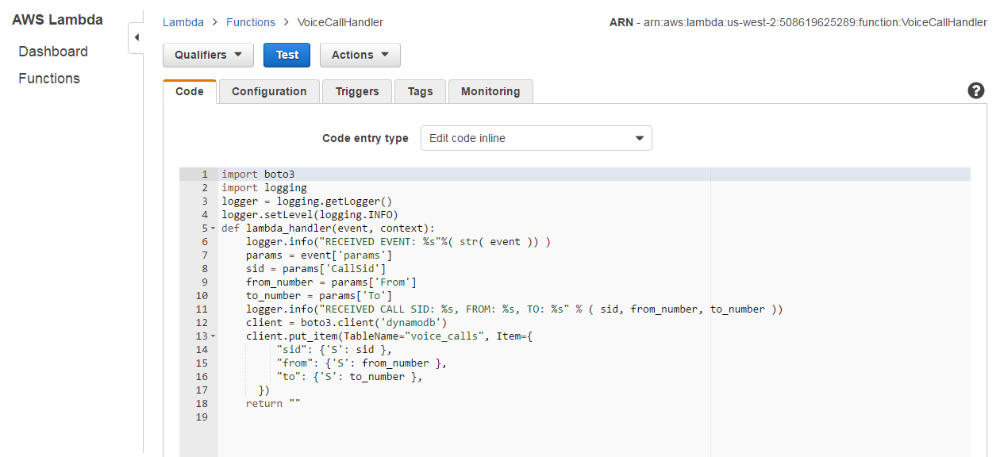
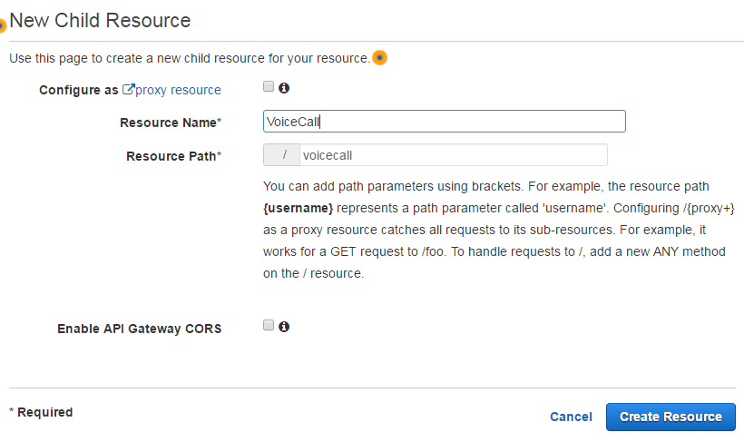

# twilio-aws

What you will need

```
AWS Account
Twilio Account
```


AWS Services you will need

```
Lambda Functions
DynamoDB
API Gateway
IAM
CloudWatch
```

# IAM Configuration 
Please enable access for Lambda and DynamoDB. This can be
done in your IAM roles. For more information please view: http://docs.aws.amazon.com/lambda/latest/dg/with-dynamodb-create-execution-role.html


# DynamoDB Configuration

You will need to create two tables "sms_messages" and "voice_calls".
Please follow the steps below to configure DynamoDB correctly.

- Create a table "sms_messages"

**Please make "sid" the primary key and click 'Create'**

- Create another table "voice_calls"
**Please make the primary key "sid", the same as "sms_messages" and click "Create"**

## When your tables are created. DynamoDB should look like


# Lambda Configuration

You will need two Lambda functions. One for incoming SMS,
and one for incoming calls. The steps below create two
handlers. Please follow the steps to setup your Lambda
functions correctly.

- Create a lambda function

**Please use "Python 2.7" as the runtime, and click "Blank Function"**
*Please do NOT setup any triggers*

- Configure the lamdba function.

*Please use "SMSMessageHandler" as the name, select runtime "Python 2.7" and the IAM role you created. 
Then click "Save"*

## In the following screen you will need to edit the function.

- Add the following code to the inline editor

*code available in resources/lambda_functions/sms_message_handler.py*

- Create a lambda function "VoiceCallHandler" 
*Please select the same runtime and IAM role as "SMSMessageHandler" 
and click "Save"*

- Add the following code to the inline editor

*code available in resources/lambda_functions/voice_call_handler.py*

# API Gateway Configuration

We need one API. This will be used for both calls and SMS. Please
follow the steps below to create the API.

- Create a new API


*Please select "New API" and use "TwilioBackend" as the "API Name"*

# Creating the "/smsmessage" resource
- Please click "Actions" -> "Create Resource"


- Please use "SMSMessage" for the resource name


- Click the "/smsmessage" endpoint


- Please click "Actions" -> "Create Method"
**Select method POST**
You will need to pick the lambda function you created earlier.

*Use Lambda Function "SMSMessageHandler" and click "Save"*

- Please goto "Integration Request"

*Click "Body Mapping Templates'*
*Add a template for "application/x-www-form-urlencoded"*


- Add the following code to the textbox

*Please click "Save"*
*code available in resources/api_gateway_templates/endpoint_body_mapper.json*

- Please goto "Integration Response"

*Click "Body Mapping Templates"*
*Add a template for 'application/xml'. Please make the body blank*


# Creating the "/voicecall" resource
**Please make sure you create the resource under the "/" root endpoint**

- Please click "Actions" -> "Create Resource"

- Please use "VoiceCall" for the resource name


- Click the "/voicecall" endpoint
**Please create a "POST" method for this endpoint and setup the "Integration Request" and "Integration Response"
the same as "/smsmessage"**

# Deploying API
- Please click "Actions" -> "Deploy API"

*Please use a deployment stage or create one*

- Click "Deploy"

- Copy the "Invoke URL"


*You will need to use endpoints "/smsmessage" and "/voicecall" so your
endpoints will need to look like:*

SMS Messages
```
https://oo0tgkx9t1.execute-api.us-west-2.amazonaws.com/development/smsmessage
```

Voice Calls
```
https://oo0tgkx9t1.execute-api.us-west-2.amazonaws.com/development/voicecall
```

# Twilio Configuration 

The Twilio account will need to be assigned the webhooks we copied
from the AWS API Gateway. Please follow these steps to setup
the Twilio.

- Please go to your "Twilio Console"

- Please go to "Phone Numbers" and click this phone number

- Configure "Voice & Fax" with Incoming URL


- Configure "Messaging" with Incoming URL


- Click "Save"

**AWS and Twilio are now configured. Your DynamoDB should
log incoming sms and calls**

# Testing

To test please send an SMS message or Call the Twilio number
used. The logs will be available in "AWS CloudWatch". You
should receive entries in your DynamoDB if everything is setup
correctly

Example of Lambda DB entry


