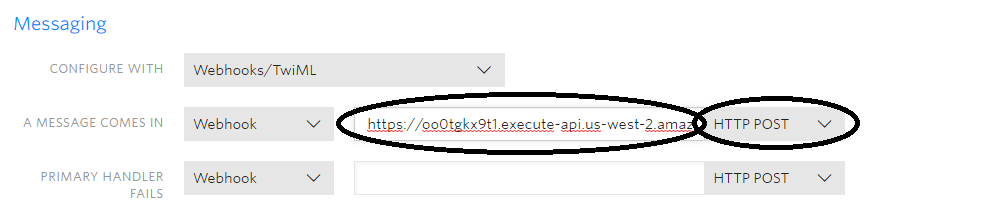

# twilio-aws

What you will need

```
AWS Account
Twilio Account
```


AWS Services you will need

```
Lambda Functions
DynamoDB
API Gateway
IAM
CloudWatch
```

# IAM Configuration 
Please enable access for Lambda and DynamoDB. This can be
done in your IAM roles. For more information please view: http://docs.aws.amazon.com/lambda/latest/dg/with-dynamodb-create-execution-role.html


# DynamoDB Configuration

- Create table "sms_messages"

**Please make "sid" the primary key**
- Create table "voice_calls"

**Please also make "sid" the primary key**

# Lambda Configuration

- Create a lamdba function "SMSMessageHandler"

Please select runtime "Python 2.7" and the IAM role you created
**Click Save**
- Add the following code to the inline editor

*code available in resources/lambda_functions/sms_message_handler.py*
- Create a lambda function "VoiceCallHandler" 
Please select the same runtime and IAM role as "SMSMessageHandler"
**Click Save**
- Add the following code to the inline editor

*code available in resources/lambda_functions/voice_call_handler.py*

# API Gateway Configuration

- Create a new API labeled "TwilioBackend"

# Creating the "/smsmessage" resource
- Please click "Actions" -> "Create Resource"

- Please use "SMSMessage" for the resource name

- Click the "/smsmessage" endpoint

- Please click "Actions" -> "Create Method"
**Select method POST**
You will need to pick the lambda function you created earlier.

*Use use Lambda Function "SMSMessageHandler"*
**Click Save**
- Goto "Integration Request"

*Click "Body Mapping Templates'*
*Add a template for "application/x-www-form-urlencoded"*

- Add the following code to the textbox

*code available in resources/api_gateway_templates/endpoint_body_mapper.json*
**Click Save**
- Goto "Integration Response"

*Click "Body Mapping Templates"*
*Add a template for 'application/xml'. Please make the body blan*


# Creating the "/voicecall" resource
**Please make sure you create the resource under the "/" root endpoint**

- Please click "Actions" -> "Create Resource"
- Please use "VoiceCall" for the resource name

- Click the "/voicecall" endpoint
- Please click "Actions" -> "Create Method"
- Please select "POST"
- Please use Lambda Function "VoiceCallHandler"
- Please setup the "Integration Request" the same as "SMSMessageHandler"
- Please setup the "Integration Response" the same as "SMSMessageHandler"
# Deploying API
- Please click "Actions" -> "Deploy API"

*Please use a deployment stage or create one*
**Click Deploy**
- Copy the "Invoke URL"


*You will need to use endpoints "/smsmessage" and "/voicecall" so your
endpoints will need to look like:*

SMS Messages
```
https://oo0tgkx9t1.execute-api.us-west-2.amazonaws.com/development/smsmessage
```

Voice Calls
```
https://oo0tgkx9t1.execute-api.us-west-2.amazonaws.com/development/voicecall
```

# Twilio Configuration 

- Login to Twilio
- Please go to "Phone Numbers" and click the phone number
- Configure "Voice & Fax" with Incoming URL

- Configure "Messaging" with Incoming URL

- Click "Save"

# Testing

To test please send an SMS message or Call the Twilio number
used. The logs will be available in "AWS CloudWatch". You
should receive entries in your DynamoDB if everything is setup
correctly

Example of Lambda DB entry


