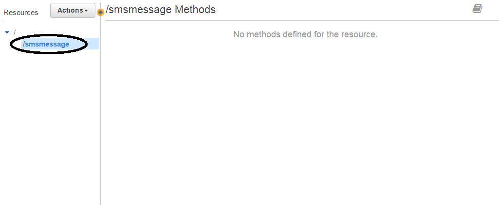

# twilio-aws

What you will need

```
AWS Account
Twilio Account
```


AWS Services you will need

```
Lambda Functions
DynamoDB
API Gateway
IAM
CloudWatch
```

# IAM Configuration 
Please enable access for Lambda and DynamoDB. This can be
done in your IAM roles. For more information please view: http://docs.aws.amazon.com/lambda/latest/dg/with-dynamodb-create-execution-role.html


# DynamoDB Configuration

You will need to create two tables "sms_messages" and "voice_calls".
Please follow the steps below to configure DynamoDB correctly.

- Create a table "sms_messages"

*Please make "sid" the primary key and click 'Create'*

- Create another table "voice_calls"

*Please make the primary key "sid", the same as "sms_messages" and click "Create"*

## When your tables are created. DynamoDB should look like


# Lambda Configuration

You will need two Lambda functions. One for incoming SMS,
and one for incoming calls. The steps below create two
handlers. Please follow the steps to setup your Lambda
functions correctly.

- Create a lambda function

*Please use "Python 2.7" as the runtime, and click "Blank Function"*

*You will need to setup "triggers". Please click "Next" at this step*

- Configure the lamdba function.

*Please use "SMSMessageHandler" as the name, select runtime "Python 2.7" and the IAM role you created. 
Then click "Save"*

## In the following screen you will need to edit the function.

- Add the following code to the inline editor

*code available in resources/lambda_functions/sms_message_handler.py*

## Creating the "VoiceCallHandler"
*Please create another function and title this function "VoiceCallHandler" then repeat the same steps as "SMSMessageHandler'*

## In the editor screen

- Add the following code to the inline editor


*code available in resources/lambda_functions/voice_call_handler.py*

- Please save all changes

# API Gateway Configuration

We need one API. This will be used for both calls and SMS. Please
follow the steps below to create the API.

- Create a new API


*Please select "New API" and use "TwilioBackend" as the "API Name"*

# Creating the "/smsmessage" resource
- Please click "Actions" -> "Create Resource"


- Please use "SMSMessage" for the resource name


- Click the "/smsmessage" endpoint


- Please create a "POST" method. Click "Actions" -> "Create Method"


*Use Lambda Function "SMSMessageHandler" and click "Save"*

## Creating a Integration Request

Our Integration Request will be specific to how Twilio calls
our API. We will be using "application/x-www-form-urlencoded" parameters
which will be passed to our Lambda functions. To create the
"Integration Request" please follow these steps

- Please go to "Integration Request"


- Please create a "Body Mapping" template for "application/x-www-form-urlencoded"

*Please select 'Never' for 'Request body passthrough*

- Add the following code to the textbox

*code available in resources/api_gateway_templates/request_body_mapper.json*

- Please save all changes

## Creating a Integration Response

We will need to create a response for our API calls. Since we are
using Twilio's WebHooks we will be using TwiML. To setup the
"Integration Response" please use the following steps:

- Please go to "Integration Response"


- Create an "Integration Response"

*You will need to create a Integration Response.
Please set Lambda response handler to "default" and Method response
code to '200'*


*the "Integration Response" should look like the screen above*

## Adding the TwiML Body Mapping template

- Please click into the Integration and open the "Body Mapping" templates
tab

- Add a Body Mapping template for "application/xml" and add the following content


*code available in resources/api_gateway_templates/response_body_mapper.xml*

- Please save all changes

# Creating the "/voicecall" resource

*Please make sure you create the resource under the "/" root endpoint*


- Please click "Actions" -> "Create Resource"


*Please create a "POST" method for this endpoint and use the same
"Integration Request", "Integration Response" as "/smsmessage'*

# Deploying API

- Please click "Actions" -> "Deploy API"


*Please use a deployment stage or create one*

- Click "Deploy"

- Copy the "Invoke URL"


*You will need to use endpoints "/smsmessage" and "/voicecall" so your
endpoints will need to look like:*

SMS Messages
```
https://oo0tgkx9t1.execute-api.us-west-2.amazonaws.com/development/smsmessage
```

Voice Calls
```
https://oo0tgkx9t1.execute-api.us-west-2.amazonaws.com/development/voicecall
```

# Twilio Configuration 

The Twilio account will need to be assigned the webhooks we copied
from the AWS API Gateway. Please follow these steps to setup
the Twilio.

- Please go to your "Twilio Console"

- Please go to "Phone Numbers" and click this phone number

- Configure "Voice & Fax" with Incoming URL


- Configure "Messaging" with Incoming URL


- Click "Save"

# Testing

To test please send an SMS message or Call the Twilio number
used. The logs will be available in "AWS CloudWatch" and "Twilio Debugger". You
should receive entries in your DynamoDB if everything is setup
correctly.

*Example of Lambda DB entry*


