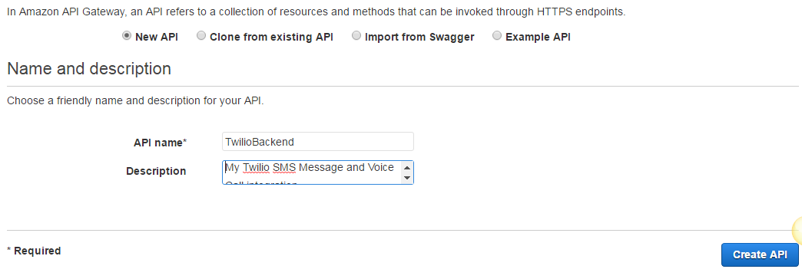

# twilio-aws

What you will need

```
AWS Account
Twilio Account
```


AWS Services you will need

```
Lambda Functions
DynamoDB
API Gateway
IAM
CloudWatch
```

# IAM Configuration 
Please enable access for Lambda and DynamoDB. This can be
done in your IAM roles. For more information please view: http://docs.aws.amazon.com/lambda/latest/dg/with-dynamodb-create-execution-role.html


# DynamoDB Configuration

- Goto DynamoDB
- Create table "sms_messages" with primary key "sid"

- Create table "voice_calls" with primary key "sid"

# Lambda Configuration

- Goto Lambda Functions
- Create a lamba function "SMSMessageHandler" with runtime "Python 2.7" and template "Blank"
- Please select the DynamoDB role you created

- Add the following code to the inline editor

* code available in resources/lambda_functions/sms_message_handler.py
- Create a lambda function "VoiceCallHandler" with runtime "Python 2.7" and template "Blank"
- Add the following code to the inline editor

* code available in resources/lambda_functions/voice_call_handler.py

# API Gateway Configuration

- Goto API Gateway
- Create a new API labeled "TwilioBackend"

- Goto Actions -> Create Resource
- Create a resource for SMS Messages

- Click the "/smsmessage" endpoint

- Goto Actions -> Create Method
- Please select "POST"
- Please use Lambda Function "SMSMessageHandler"

- Click Save
- Goto "Integration Request"

- Click "Body Mapping Templates"
- Add a template for "application/x-www-form-urlencoded"

- For the template contents please use

* code available in resources/api_gateway_templates/endpoint_body_mapper.json
- Click Save
- Goto "Integration Response"

- Click "Body Mapping Templates"
- Please create a default mapping of "application/xml" and make the content blank

- Goto Actions -> Create Resource
- Create a resource for Voice Calls

* Please make sure you create the resource under the "/" root endpoint
- Click the "/voicecall" endpoint
- Goto Actions -> Create Method
- Please select "POST"
- Please use Lambda Function "VoiceCallHandler"
- Please setup the "Integration Request" the same as "SMSMessageHandler"
- Goto Actions -> "Deploy API"
- Please use a deployment stage or create one

- Click "Deploy"
- Copy the "Invoke URL"

* You will need to use endpoints "/smsmessage" and "/voicecall" so your
endpoints will need to look like:

SMS Messages
```
https://oo0tgkx9t1.execute-api.us-west-2.amazonaws.com/development/smsmessage
```

Voice Calls
```
https://oo0tgkx9t1.execute-api.us-west-2.amazonaws.com/development/voicecall
```

# Twilio Configuration 

- Please goto Phone Numbers
- Please click into a Phone Number
- Configure "Voice & Fax" with Incoming URL

- Configure "Messaging" with Incoming URL

- Click "Save"

# Testing

To test please send an SMS message or Call the Twilio number
used. The logs will be available in "AWS CloudWatch". You
should receive entries in your DynamoDB if everything is setup
correctly

Example of Lambda DB entry


